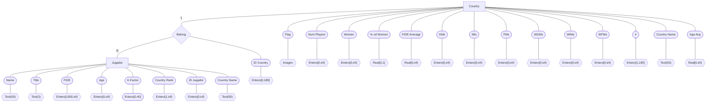
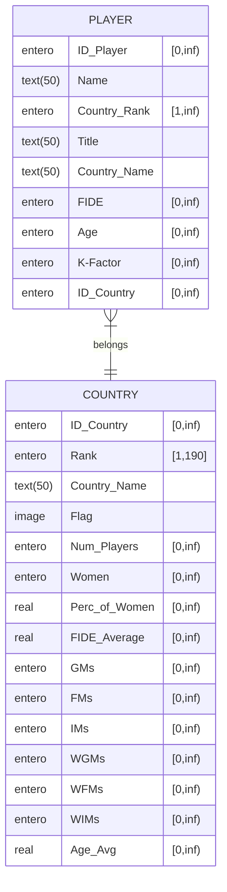

# TAREA 2

## Opción 1

```mermaid
flowchart 
    id1[Jugador]---j1([Name])
    j1---dj1{{"Text(50)"}}
    id1[Jugador]---j2([Title])
    j2---dj2{{"Text(3)"}}
    id1[Jugador]---j3([FIDE])
    j3---dj3{{"Entero[1000,inf)"}}
    id1---j4([Age])
    j4---dj4{{"Entero[0,inf)"}}
    id1---j5([K-Factor])
    j5---dj5(["Entero[0,40]"])
    id2[Country]--1---r1{Belong}
    r1--N---id1
    id1---j6([Country Rank])
    j6---dj6{{"Entero[1,inf)"}}
    id1---j7(["ID Jugador"])
    j7---dj7{{"Entero[0,inf)"}}
    id1---j8(["Country Name"])
    j8---dj8{{"Text(50)"}}
    jc2---djc2{{"Entero[0,189]"}}
    r1---jc2([ID Country])
    id2---c1([Flag])
    c1---dc1{{Imagen}}
    id2---c2([Num Players])
    c2---dc2{{"Entero[0,inf)"}}
    id2---c3([Women])
    c3---dc3{{"Entero[0,inf)"}}
    id2---c4([% od Women])
    c4---dc4{{"Real[0,1]"}}
    id2---c5([FIDE Average])
    c5---dc5{{"Real[0,inf)"}}
    id2---c6([GMs])
    c6---dc6{{"Entero[0,inf)"}}
    id2---c7([IMs])
    c7---dc7{{"Entero[0,inf)"}}
    id2---c8([FMs])
    c8---dc8{{"Entero[0,inf)"}}
    id2---c9([WGMs])
    c9---dc9{{"Entero[0,inf)"}}
    id2---c10([WIMs])
    c10---dc10{{"Entero[0,inf)"}}
    id2---c11([WFMs])
    c11---dc11{{"Entero[0,inf)"}}
    id2---c12(["#"])
    c12---dc12{{"Entero[1,190]"}}
    id2---c13(["Country Name"])
    c13---dc13{{"Text(50)"}}
    id2---c14([Age Avg])
    c14---dc14{{"Real[0,inf)"}}  
```

## Opción 2

```mermaid
erDiagram
PLAYER}|--||COUNTRY:belongs
PLAYER{
    entero ID_Player "[0,inf)"
    text(50) Name
    entero Country_Rank "[1,inf)"
    text(50) Title
    text(50) Country_Name
    entero FIDE "[0,inf)"
    entero Age "[0,inf)"
    entero K-Factor "[0,inf)"
    entero ID_Country "[0,inf)"

}
    
COUNTRY {
    entero ID_Country "[0,inf)"
    entero Rank "[1,190]" 
    text(50) Country_Name
    image Flag 
    entero Num_Players "[0,inf)"
    entero Women "[0,inf)"
    real Perc_of_Women "[0,inf)"
    real FIDE_Average "[0,inf)"
    entero GMs "[0,inf)"
    entero FMs "[0,inf)"
    entero IMs "[0,inf)"
    entero WGMs "[0,inf)"
    entero WFMs "[0,inf)"
    entero WIMs "[0,inf)"
    real Age_Avg "[0,inf)"
} 
```