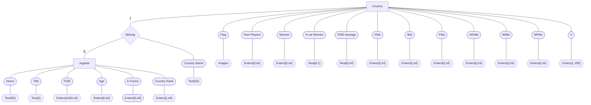

# TAREA 2

```mermaid
flowchart 
    id1[Jugador]---j1([Name])
    j1---dj1{{"Text(50)"}}
    id1[Jugador]---j2([Title])
    j2---dj2{{"Text(3)"}}
    id1[Jugador]---j3([FIDE])
    j3---dj3{{"Entero[1000,inf)"}}
    id1---j4([Age])
    j4---dj4{{"Entero[0,inf)"}}
    id1---j5([K-Factor])
    j5---dj5(["Entero[0,40]"])
    id2[Country]--1---r1{Belong}
    r1--N---id1
    id1---j6([Country Rank])
    j6---dj6{{"Entero[1,inf)"}}
    jc2---djc2{{"Text(50)"}}
    r1---jc2([Country Name])
    id2---c1([Flag])
    c1---dc1{{Imagen}}
    id2---c2([Num Players])
    c2---dc2{{"Entero[0,inf)"}}
    id2---c3([Women])
    c3---dc3{{"Entero[0,inf)"}}
    id2---c4([% od Women])
    c4---dc4{{"Real[0,1]"}}
    id2---c5([FIDE Average])
    c5---dc5{{"Real[0,inf)"}}
    id2---c6([GMs])
    c6---dc6{{"Entero[0,inf)"}}
    id2---c7([IMs])
    c7---dc7{{"Entero[0,inf)"}}
    id2---c8([FMs])
    c8---dc8{{"Entero[0,inf)"}}
    id2---c9([WGMs])
    c9---dc9{{"Entero[0,inf)"}}
    id2---c10([WIMs])
    c10---dc10{{"Entero[0,inf)"}}
    id2---c11([WFMs])
    c11---dc11{{"Entero[0,inf)"}}
    id2---c12(["#"])
    c12---dc12{{"Entero[1,190]"}}


```