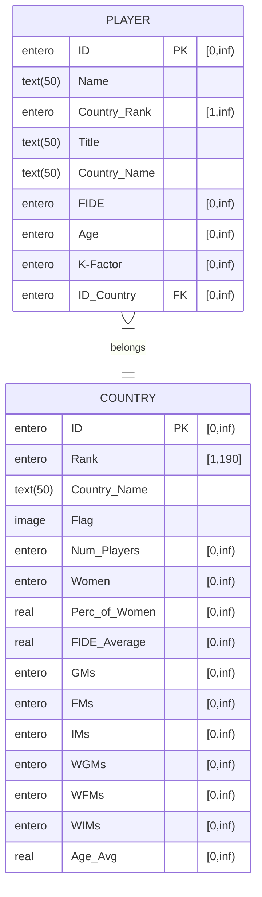

# TAREA 3
## Relaciones

Player(**ID**,Name, Country_Rank, Title, Country_Name, FIDE, Age, K-Factor, ID_Country)

Country(**ID**, Rank, Country_Name, Flag, Num_Players, Women, Perc_of_Women, FIDE_Average, GMs, FMs, IMs, WGMs, WFMs, WIMs, Age_Avg)

## Diagrama

## Operaciones
