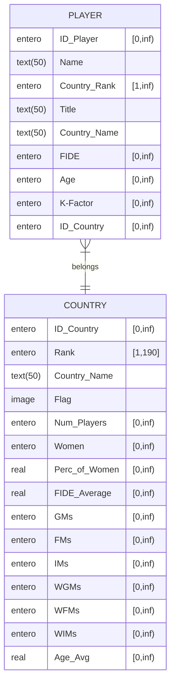

# TAREA 3
Country

Player

## Diagrama

```mermaid
erDiagram
PLAYER}|--||COUNTRY:belongs
PLAYER{
    entero ID_Player "[0,inf)"
    text(50) Name
    entero Country_Rank "[1,inf)"
    text(50) Title
    text(50) Country_Name
    entero FIDE "[0,inf)"
    entero Age "[0,inf)"
    entero K-Factor "[0,inf)"
    entero ID_Country "[0,inf)"

}
    
COUNTRY {
    entero ID_Country "[0,inf)"
    entero Rank "[1,190]" 
    text(50) Country_Name
    image Flag 
    entero Num_Players "[0,inf)"
    entero Women "[0,inf)"
    real Perc_of_Women "[0,inf)"
    real FIDE_Average "[0,inf)"
    entero GMs "[0,inf)"
    entero FMs "[0,inf)"
    entero IMs "[0,inf)"
    entero WGMs "[0,inf)"
    entero WFMs "[0,inf)"
    entero WIMs "[0,inf)"
    real Age_Avg "[0,inf)"
} 
```

## Operaciones
